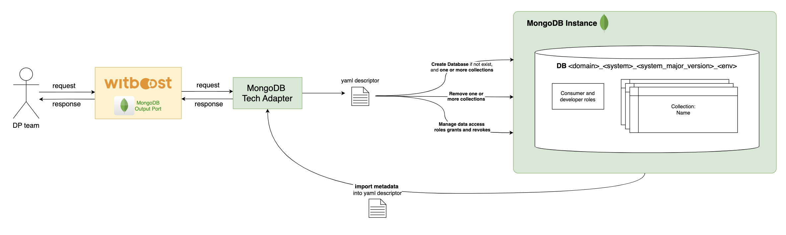
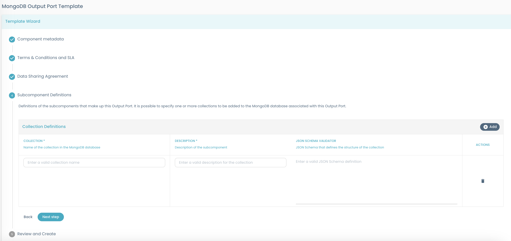

    

Designed by [Agile Lab](https://www.agilelab.it/), Witboost is a versatile platform that addresses a wide range of sophisticated data engineering challenges. It enables businesses to discover, enhance, and productize their data, fostering the creation of automated data platforms that adhere to the highest standards of data governance. Want to know more about Witboost? Check it out [here](https://witboost.com/) or [contact us!](https://witboost.com/contact-us)

This repository is part of our [Starter Kit](https://github.com/agile-lab-dev/witboost-starter-kit) meant to showcase Witboost's integration capabilities and provide a "batteries-included" product.

# MongoDB Output Port Template

- [Overview](#overview)
- [Usage](#usage)

## Overview

Use this template to automatically configure a MongoDB database instance through a Witboost Output Port. The configuration is executed by the **MongoDB Tech Adapter**. It allows the creation of databases (if not already existing), collections, and user roles directly on the MongoDB instance. Additionaly, it can be used to import existing collections to the Witboost lifecycle.

The MongoDB Output Port Template guides you through the configuration of a secure and well-defined Output Port for exposing data from a MongoDB instance.

- **Component Metadata**: Basic information such as name, description, domain, related Data Product, ownership, and tags.
- **Terms & Conditions and SLA**: Define usage policies, data refresh interval, timeliness, and availability.
- **Data Sharing Agreement**: Specify governance details including purpose, billing, security, usage, limitations, lifecycle, and confidentiality.
- **Subcomponent Definitions**: Configure one or more MongoDB collections by providing their name, description, and an optional JSON Schema for validation.

### What's a Template?

A Template is a tool that helps create components inside a Data Mesh. Templates help establish a standard across the organization. This standard leads to easier understanding, management and maintenance of components. Templates provide a predefined structure so that developers don't have to start from scratch each time, which leads to faster development and allows them to focus on other aspects, such as testing and business logic.

For more information, please refer to the [official documentation](https://docs.witboost.com/docs/p1_user/p6_advanced/p6_1_templates#getting-started).

#### Skeleton Entities

Introduced in **Witboost 2.3**, Skeleton Entities provide a more dynamic and user-friendly approach to define systems and components. They seamlessly integrate with tools like the Editor Wizard and the Reverse Provisioning Wizard, allowing for easier entity management.

For more information, please refer to the [official documentation](https://docs.witboost.com/docs/p3_tech/p12_catalog/p12_2_skeleton_entities).

The template uses this new feature. The old version of the template, that generates instead [Legacy Entities](https://docs.witboost.com/docs/p3_tech/p12_catalog/p12_2_skeleton_entities/#skeleton-vs-legacy-entities), can be found in this same repository in the branch `release/v1`.

### What's an Output Port?

Output ports are one of the main components for the Data Mesh data platform taxonomy. They allow exposing the Data Product information to users using a well annotated and structured port, as well as handling access control.

### MongoDB

MongoDB is a general-purpose, document-oriented NoSQL database designed for high performance, high availability, and easy scalability. It stores data in flexible, JSON-like documents, meaning fields can vary from document to document and data structure can be changed over time.

MongoDB combines the power of traditional relational databases with the flexibility of modern NoSQL architectures. It is designed to handle large volumes of structured and unstructured data, making it ideal for a wide range of applications — from real-time analytics to content management and IoT.

For example, MongoDB supports powerful indexing and querying capabilities, dynamic schemas, and horizontal scalability through sharding. Its architecture also enables high availability through replica sets and built-in fault tolerance.

MongoDB provides the foundation for building modern, cloud-native applications that need to process and serve massive amounts of data in real time. It is widely used across industries for its developer-friendly model and operational simplicity.

- MongoDB includes the following key capabilities:
- Flexible, document-based data model
- Powerful query language and secondary indexes
- Horizontal scalability with sharding
- High availability with replica sets
- Integrated aggregation framework for analytics
- Rich ecosystem of drivers and tools
- Cloud-native experience with MongoDB Atlas

Learn more on [MongoDB documentation](https://www.mongodb.com/docs/)

## Usage

To get information on how to use this template, refer to this [document](./docs/index.md).

### Component Testing

To verify the component before deploying it along with the Data Product, the component needs to be tested against a CUE Policy defined for [MongoDB Output Port](./policies/mongodb.cue). This policy needs to be defined inside the **Governance** section of the Witboost Platform.

For more information, please refer to the [official documentation](https://docs.witboost.com/docs/p1_user/p5_managing_policies/p5_1_overview/).

## License

This project is available under the [Apache License, Version 2.0](https://opensource.org/licenses/Apache-2.0); see [LICENSE](LICENSE) for full details.

## About Witboost

[Witboost](https://witboost.com/) is a cutting-edge Data Experience platform, that streamlines complex data projects across various platforms, enabling seamless data production and consumption. This unified approach empowers you to fully utilize your data without platform-specific hurdles, fostering smoother collaboration across teams.

It seamlessly blends business-relevant information, data governance processes, and IT delivery, ensuring technically sound data projects aligned with strategic objectives. Witboost facilitates data-driven decision-making while maintaining data security, ethics, and regulatory compliance.

Moreover, Witboost maximizes data potential through automation, freeing resources for strategic initiatives. Apply your data for growth, innovation and competitive advantage.

[Contact us](https://witboost.com/contact-us) or follow us on:

- [LinkedIn](https://www.linkedin.com/showcase/witboost/)
- [YouTube](https://www.youtube.com/@witboost-platform)

